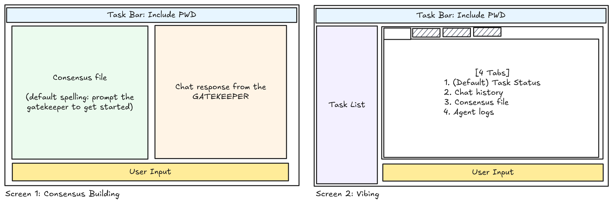

# TUI Redesign Guide

The TUI of project Vibrant requires a redesign to enhance user experience. The details of the new user interface are outlined below.

## Initization Screen (Finished)

Upon entering the software, it will check whether the present directory has been initialized. If so, it will directly enter the planning screen or the vibing screen, depending on the state of the project. If not, initialization screen will be shown.

The initialization screen has a logo in the top, and three options listed below:

- Initialize Project Here
- Initialize Project (Select Directory)
- Exit

When choosing a directory, the path input should support filesystem autocomplete with a dropdown list so users can quickly select an existing folder.

## Planning Screen

The planning phase is also named "Consensus Building". "Tell me what you want to build" is displayed as default text in the user input box, and the user engages in a conversation with the Gatekeeper (a codex session spawned by the Orchestrator immediately after initialization). The Gatekeeper will ask questions until it has enough information to build a consensus (not a detailed roadmap, but a general understanding of what the project should be, and what decision choices the user prefers). If the user is satisfied, he types `/vibe` to enter the vibing phase.

The planning screen is depicted in the left part of the image above.

## Vibing Screen

The vibing phase is where the gatekeeper can use Orchestrator as MCP to execute tasks, and the user can see the progress of the project, and the updated consensus so that he/she can give feedback to the gatekeeper.

The screen, shown in the right part of the image above, is divided into these sections:
- Appbar (top): As always, shows project name (pwd dir name) after Vibrant version.
- Task Bar (left): Shows the tasks executing and waiting in the queue. When user clicks on a task
- Main Screen (right-top): Shows one of four tabs:
    - Task Status: shows the progress of the current task, and is the default tab when entering the vibing phase;
    - Chat history with the gatekeeper. This is the default tab when entering FROM the planning phase;
    - Consensus file;
    - Agent Logs (for debugging purpose);

Before the roadmap is generated, both the Task Status and the Chat History tabs will show a "Generating Roadmap" loading spinner to indicate that the gatekeeper is working on building the roadmap from the consensus.
